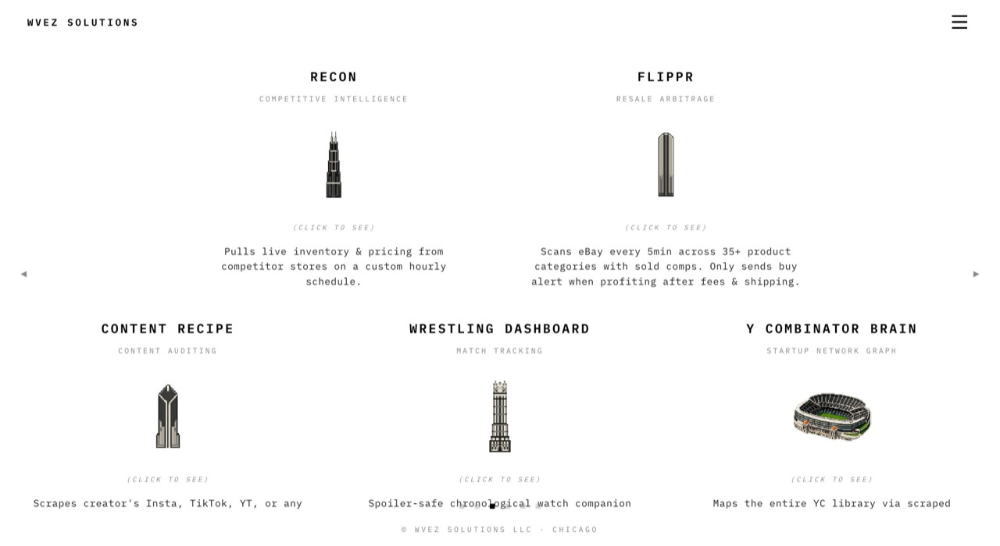

# wvez.org

The site for WVEZ Solutions, a one person automation studio in Chicago. It is the
portfolio and three interactive demos of workflows I have built.



Live:

| | |
|---|---|
| [wvez.org](https://wvez.org) | The site. Six panels, a 3D pendant, a photo and video viewer |
| [wvez.org/recon](https://wvez.org/recon) | RECON, competitive inventory and pricing surveillance |
| [wvez.org/flippr](https://wvez.org/flippr) | FLIPPR, eBay resale arbitrage scanning |
| [wvez.org/crp](https://wvez.org/crp) | Content Recipe, creator content auditing |

## Stack

Hand written HTML, CSS and JavaScript. No framework and no build step for the site
itself. IBM Plex Mono throughout, black text on white, pixel art as the only color.
Hosted on GitHub Pages, which also builds the blog with Jekyll when it is turned on.

Each demo is a single self contained file. They run entirely in the browser, call no
real service, and the numbers they display are invented.

## Running it

```bash
python3 -m http.server 8000
```

That serves the landing page and the three demos exactly as they are. It does not run
Jekyll, so anything under `_layouts` or `_posts` will not render locally.

## The blog, which is built but switched off

There is a working Jekyll blog in this repository that nothing publishes yet. `blog.html`
carries `published: false` and the feed plugin is commented out in `_config.yml`, so
`/blog` and `/feed.xml` are not on the live site. Drafts sit in `_drafts/`.

Turning it on is three edits: delete the `published: false` line from `blog.html`,
uncomment the two blocks in `_config.yml`, and move a draft into `_posts/` with a dated
filename. It is off because I have not decided where writing belongs in the site's
navigation.

## Publishing a post, once it is on

Add a file to `_posts/` named `YYYY-MM-DD-slug.md`:

```markdown
---
title: The title as it should read
date: 2026-09-22
description: One line. This shows on the index and in the RSS feed.
---
```

Write the body in markdown, then push. The post appears at `wvez.org/blog/slug/` in
about a minute, and the index and the feed update themselves. While the blog is off,
keep the file in `_drafts/` instead, where it needs no date in the filename.

When a build fails, GitHub emails the error and keeps serving the last good version of
the site. To read the error:

```bash
gh api repos/warner-wvez/wvez-landing/pages/builds/latest --jq '{status,error:.error.message}'
```

## Layout

```
index.html          the site
crp/ flippr/ recon/ the demos, one file each, URLs are frozen
assets/             images, video, pixel art, the two 3D models
_posts/             published blog posts, one markdown file each
_drafts/            written but not published
_layouts/           the blog's shell and post template
_includes/          custom components, currently just the aside box
blog.html           the writing index, currently published: false
docs/decisions.md   why the site is built this way
```

## House rules

- No em dashes and no emojis, anywhere.
- No large empty regions on any page or in any state.
- `/`, `/crp`, `/flippr` and `/recon` have been shared publicly. They do not move.

Commit messages go through `.githooks/commit-msg`. See [CONTRIBUTING.md](CONTRIBUTING.md).

## License

[PolyForm Noncommercial 1.0.0](LICENSE). Read it, learn from it, do not sell it.
